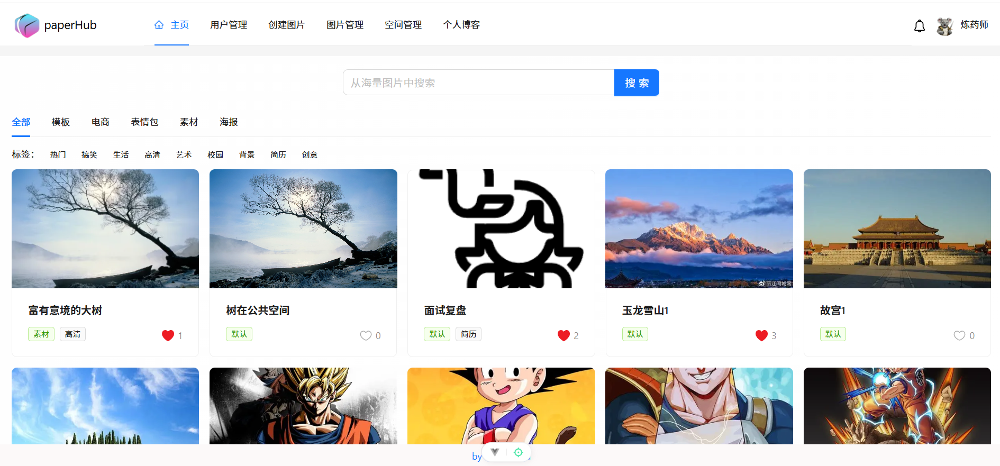
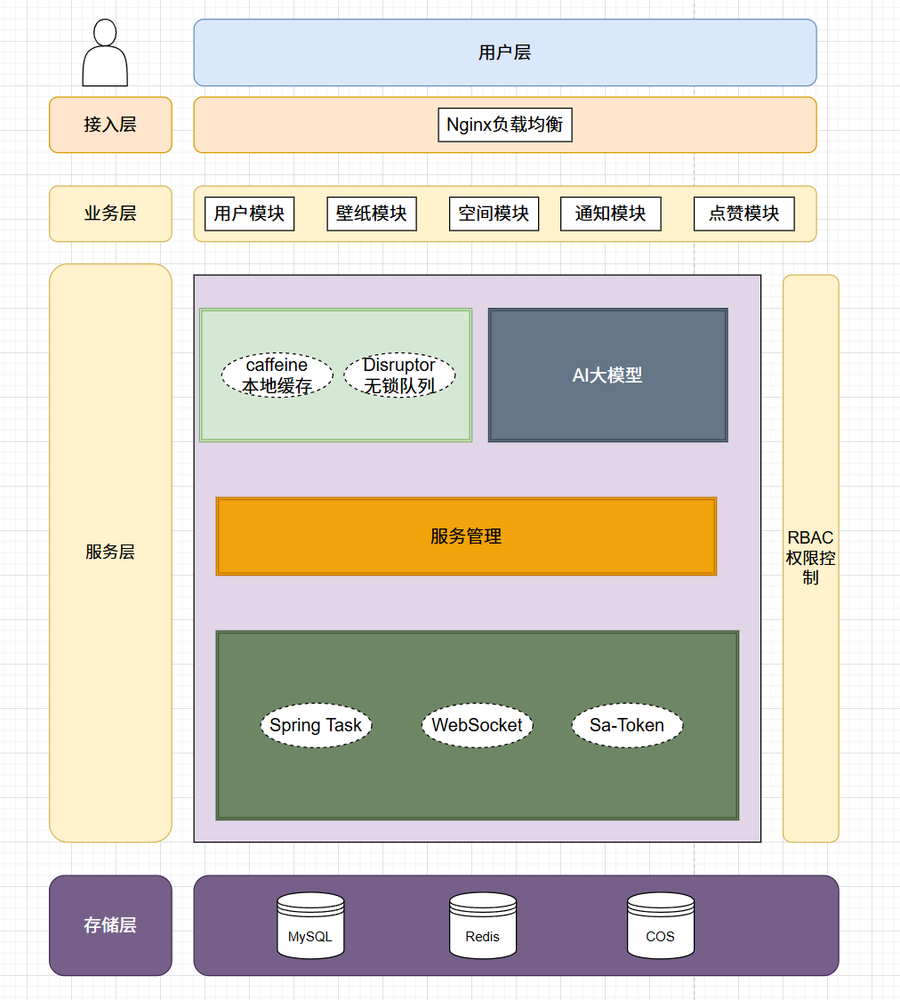

# paperHub
基于 Vue 3 + Spring Boot + COS + WebSocket 的高清壁纸网站

## 核心模块：
- 用户模块：提供用户注册、登录、鉴权等功能，利用 Redis 实现分布式 Session 登录。
- 图片模块：负责图片增删改查、上传、多维搜索、批量编辑、批量抓图等操作，并结合 COS 对象存储完成图片管理，结合数据万象完成图片解析、压缩和缩略图生成，
- 空间模块：支持创建私有空间和团队空间，并提供空间成员管理、空间额度控制、空间图片共享、多人协同编辑等功能。基于 Sa-Token 实现 RBAC 权限模型，可灵活控制空间成员权限。 -AI 模块：通过自主封装的 AI 接口，对接 AI 绘画大模型实现 AI 扩图功能，支持异步任务轮询。
- 协作模块：基于 WebSocket 实现多人实时编辑图片，利用 “编辑锁” 及事件驱动设计降低并发冲突风险，并采用 Disruptor 技术提升吞吐量。
- 分析模块：对空间使用情况、图片分类、空间排行等进行统计，基于 MyBatis Plus 和分组查询（group by）实现聚合分析。
- 缓存模块：引入 Redis + Caffeine 构建多级缓存体系，显著降低主页图片数据的查询耗时，同时通过随机过期时间避免缓存雪崩。
## 架构设计
